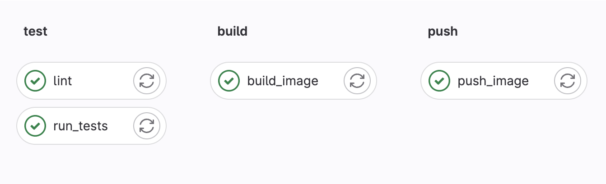

Lab2: Continuous Integration Using GitLab

Enhance Your Development Process with a Hands-On Laboratory Experience in Continuous Integration using GitLab.
In this lab, you will learn how to set up a Continuous Integration (CI) pipeline using GitLab, a popular repository management software. By the end of the lab, you will have a basic understanding of how CI works and be able to apply this knowledge to your own development projects.

Here are the steps you will need to follow:

Create a new private repository on your personal GitLab.com account and clone the code from repository cicd-python-demoapp to your new repository. This will allow you to work with a sample codebase that demonstrates best practices in CI/CD and containerization.
Set up a GitLab account and create a Personal Access Token. This is a best practice for secure access to pipeline jobs and the container registry, as it eliminates the need to use a password for accessing GitLab. The Personal Access Token will allow you to authenticate with GitLab securely and access the resources you need to build your pipeline.
Create a pipeline in GitLab that automatically lint, builds, tests, and pushes packages to the GitLab container registry. Name the build image using variables, with IMAGE_TAG set to "v1.0.0" and the image's name in the format of "$CI_REGISTRY/$CI_PROJECT_NAMESPACE/$CI_PROJECT_NAME:$IMAGE_TAG". This step will demonstrate how to configure GitLab to automatically build and test your code whenever changes are made to the repository.
Configure GitLab to run your build pipeline on a regular schedule or when triggered by code changes. The pipeline should include steps to lint, build, test, and push the code with an image tag of "v1.0.0". This step will show you how to set up a pipeline that runs automatically and ensures that your code is always tested and up-to-date.
By completing this lab, you will gain practical experience with CI/CD and GitLab, and learn best practices for building and testing code. You will also be equipped with the skills you need to implement CI/CD in your own development projects.

n this lab, you will learn how to set up a Continuous Integration (CI) pipeline using GitLab, a popular repository management software. By the end of the lab, you will have a basic understanding of how CI works and be able to apply this knowledge to your own development projects.

Here are additional links to GitLab's official documentation that may be useful for setting up your pipeline:

Defining stages and jobs in GitLab CI/CD pipelines: https://docs.gitlab.com/ee/ci/yaml/README.html
Using Docker images in GitLab CI/CD pipelines: https://docs.gitlab.com/ee/ci/docker/using_docker_images.html
Setting up artifacts in GitLab CI/CD pipelines: https://docs.gitlab.com/ee/ci/pipelines/job_artifacts.html
We require you to submit a single .pdf file containing the following:

Two screenshots of the GitLab UI demonstrating your configured pipelines and successful job executions.
.gitlab-ci.yml file created for your GitLab pipeline.
Two screenshots of your browser showing the deployed application from branch.(optional)
Any additional task-related code if any tasks were executed during this process.

Here is an example of a .gitlab-ci.yml file that demonstrates how to set up a pipeline that builds and tests a push.

variables:

  PROJECT_NAMESPACE: my-namespace
  CI_PROJECT_NAME: my-project
  IMAGE_TAG: latest

stages:
  - test
  - build
  - push

build:
  stage: build
  script:
    - echo "stage build"
test:
  stage: test
  script:
    - echo "stage test"

deploy:
  stage: deploy
  script:
     - echo "stage deploy"

Upload the .pdf file to the platform using the "Upload your assignment" button below and click “Submit”.
Please pay attention, that you have only one attempt to submit your file!

Unfortunately, checking this lab is not yet automated. Therefore, your solution may be left unchecked if you take this course without the support of a mentor.
Otherwise, provide your mentor with access to your private GitLab repository. This will allow them to review your work and provide feedback and guidance as needed.

Please name your .pdf in the following way: Continuous_Integration_GitLab_[your_first_name]_[your_last_name].pdf