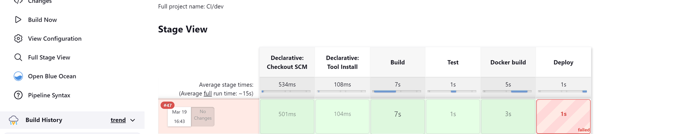
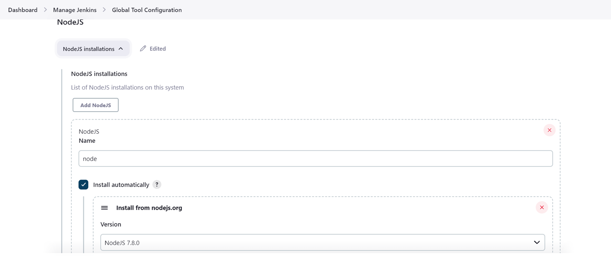
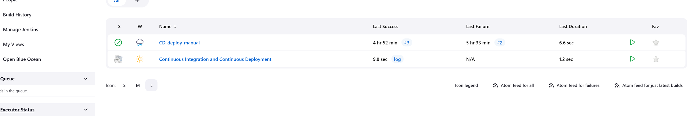
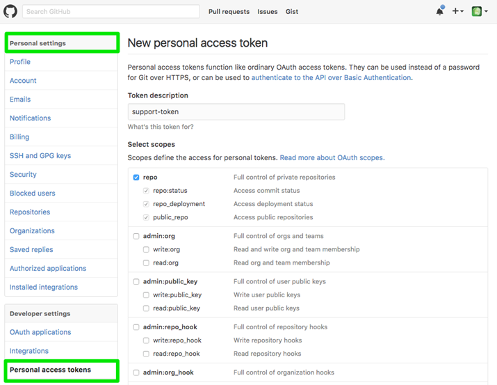
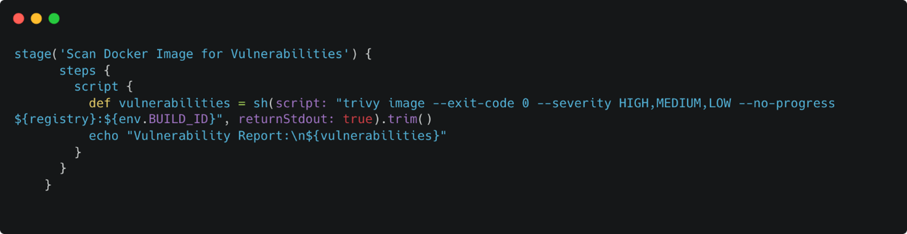

Lab3: Continuous Integration and Delivery using Jenkins

Task:
Setting up a Multibranch pipeline and regular Jenkins pipelines with manual or auto triggers for deploying an application.

Objective:
The objective of this task is to train systems engineers to set up a Multibranch pipeline and a Manual pipeline for deploying an application with different ports depending on envs and changing logo.svg files depending on envs (branch name) as well. The engineers will learn how to create two branches - main and dev, in GIT these branches will be in envs role as well, configure stages for checkout, build, test, build docker image, and deploy, and make changes to the picture and ports for each branch.

Prerequisites:
To complete this task, the engineers should have the following prerequisites:

Knowledge of Git, Docker, Jenkins
Understanding of application deployment process
Knowledge of basic scripting
Installed Jenkins on Linux VM - https://www.jenkins.io/download and list of plugins: Docker Pipeline, Docker plugin, Git plugin, Groovy, NodeJs plugin, Pipeline.

Details:
After triggering main or dev branch you have such stages as checkout – build – test – build docker image – deploy. You must change the picture "logo.svg" for main and dev branches. You can put any pictures you want there but in the .svg format. You should see the difference after application deployment. Also, you should change ports, for the main branch it is 3000 and 3001 for dev as well. It looks like http//localhost:3000 or http://localhost:3001. You perform change of logo.svg in corresponding branches dev and main and you should add conditional logic to your pipeline to set port number depending on branch.

Global goal is creation of two Jenkins pipelines. The first is a multibranch pipeline called "CICD", the second one is a regular pipeline called "CD_deploy_manual" and it should be manually triggered to execute deployment. You should pull this repo - https://github.com/epam-msdp/cicd-pipeline to your local machine, then create your own repo on GitHub and push files contained inside this repo, after this you must create a new branch called dev and, in the end, you will see two branches "main" and "dev"

Predictive result:

Steps:
Click the arrows to see more information.

1. Configure global tools configuration Node 7.8.0.

2. Create multibranch and one regular pipeline.

Advanced tasks:
Click the arrows to see more information.

In result you will have two different docker image IDs locally (nodemain:v1.0 and nodedev:v1.0). Right now, during deployment our pipeline deletes all containers, but since we have different envs, it is better to keep containers not related to selected env untouched. Try to adjust pipeline to delete containers only for deployed env.

Create your own repository in docker hub. Setup docker credentials in Jenkins and push your newly created images into your repository. In this case you should create two additional pipelines called “Deploy_to_main” and “Deploy_to_dev” and trigger them automatically at the end of Multibranch pipeline depending on branch. These two pipelines will pull your images from repository and deploy them into matching env (Docker pull nodemain:v1.0 and docker pull nodedev:v1.0 for dev branch and next docker run -d -expose -p 3000:3000 your image). Please pay attention to the fact that you should fix your existing Multibranch pipeline with push stage.

Appendix:
Click each heading to see more information.

GitHub API token scopes for Jenkins
Jenkins' scope requirements depend on the task/s you would like to perform:

admin:repo_hook - for managing hooks at GitHub Repositories level including for Multibranch Pipeline
admin:org_hook - for managing hooks at GitHub Organizations level for GitHub Organization Folders
repo - to see private repos. Please note that this is a parent scope, allowing full control of private repositories that includes:
repo:status - to manipulate commit statuses
repo: repo_deployment - to manipulate deployment statuses
repo: public_repo - to access to public repositories
read:org and user:email - recommended minimum for GitHub OAuth Plugin- scopes.

How to add Trivy to Jenkins pipeline

As a result, you should provide us with one .pdf file that includes:

Two screenshots of Jenkins UI with your pipelines
Two Jenkinsfile created by Jenkins
Two screenshots of browser with deployed application from main and dev branches
Any additional tasks related code if tasks were done
Upload the .pdf file to the platform using the "Upload your assignment" button below and click “Submit”.
Please pay attention, that you have only one attempt to submit your file!

Unfortunately, checking this task is not yet automated. Therefore, your solution may be left unchecked if you take this course without the support of a mentor.
Otherwise, provide your mentor with access to your private GitLab repository. This will allow them to review your work and provide feedback and guidance as needed.

Please name your .pdf in the following way: Cloud_DevOps_CICD_[your_first_name]_[your_last_name].pdf