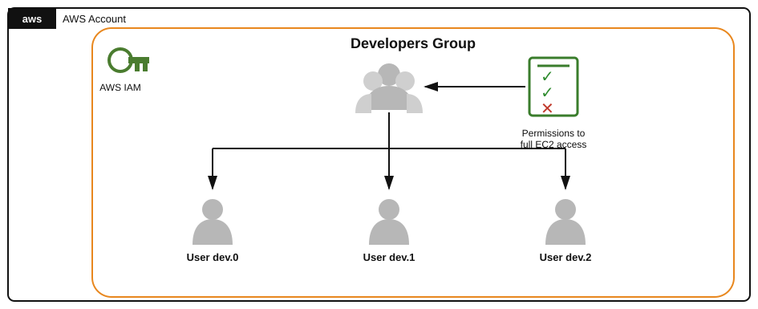

# Teoría — Permisos de grupo IAM y herencia hacia usuarios

## Diagrama de la infraestructura del lab



Versión en texto (organigrama):

```
AWS Account
└── AWS IAM
    └── Developers Group ────── Permissions: full EC2 access (✔ ✔ ✘)
        │
        ├── User dev.0
        ├── User dev.1
        └── User dev.2
```

La política de EC2 se adjunta **una sola vez, al grupo** (la flecha "Permissions to full EC2 access" apunta al grupo, no a cada usuario). Los tres usuarios cuelgan del grupo y heredan ese permiso automáticamente por pertenecer a él — de ahí que la tarea sea "un solo movimiento" aunque haya 3 usuarios involucrados.

## IAM Groups

Un **grupo de IAM** es una colección de usuarios. Las políticas que se adjuntan a un grupo se **heredan automáticamente** por todos sus miembros — no hay que adjuntar nada individualmente a cada usuario. Esto es la base de la gestión de permisos "por rol de equipo" en vez de "por persona":

```
Política (permisos) → Grupo → Usuarios miembros (heredan los permisos del grupo)
```

Ventajas frente a adjuntar políticas usuario por usuario:
- Un solo punto de cambio: agregar/quitar una política del grupo afecta a todos sus miembros a la vez.
- Onboarding/offboarding más simple: agregar un usuario nuevo al grupo le da automáticamente los permisos correctos; sacarlo se los quita.
- Menor riesgo de "permission drift" (usuarios con permisos inconsistentes por olvidos manuales).

Un usuario puede pertenecer a varios grupos, y sus permisos efectivos son la **unión** de todas las políticas de todos sus grupos (más cualquier política adjuntada directamente al usuario).

## Principio de mínimo privilegio (least privilege)

Consiste en otorgar únicamente los permisos estrictamente necesarios para la función de un usuario/rol — ni más ni menos. Aplicado a este lab: en vez de usar `AdministratorAccess` (acceso total a la cuenta) o `PowerUserAccess` (todo excepto gestión de usuarios/permisos), se usa **`AmazonEC2FullAccess`**, una política administrada por AWS que da acceso completo *solo* al servicio EC2. Así:

- El grupo puede hacer todo lo que necesite con EC2 (crear/parar/terminar instancias, security groups, etc.).
- El grupo **no** puede tocar IAM, S3, ni ningún otro servicio — reduce la superficie de riesgo si una credencial de ese grupo se ve comprometida.

## Políticas administradas por AWS (`AWS managed policies`)

Son políticas mantenidas por AWS, con nombres reconocibles como `AmazonEC2FullAccess`, `AmazonS3ReadOnlyAccess`, `AmazonEC2ReadOnlyAccess`, etc. Convención habitual: `<Servicio><Nivel>Access` donde el nivel suele ser `FullAccess`, `ReadOnlyAccess` o algo más granular. Usarlas en vez de crear políticas propias (customer managed / inline) tiene ventajas para este tipo de tareas:
- Ya están auditadas y mantenidas por AWS (se actualizan si el servicio agrega nuevas acciones).
- Evitan el riesgo de escribir un JSON de política mal formado o demasiado permisivo/restrictivo.
- Es lo que exige explícitamente el enunciado de este lab ("Utilice una política administrada por AWS... No cree su propia política").

## Login profile vs. Access keys

Un usuario de IAM puede tener dos formas de autenticación completamente independientes:

- **Login profile** (contraseña de consola): permite iniciar sesión en la Consola web de AWS. Se gestiona con `create-login-profile` / `update-login-profile` / `delete-login-profile`.
- **Access keys**: para acceso programático (CLI/SDK), independiente de si el usuario tiene o no contraseña de consola.

Un usuario recién creado (por CLI, sin marcar "console access" al crearlo) **no tiene login profile por defecto** — hay que crearlo explícitamente con `create-login-profile` antes de poder loguearse por consola.
