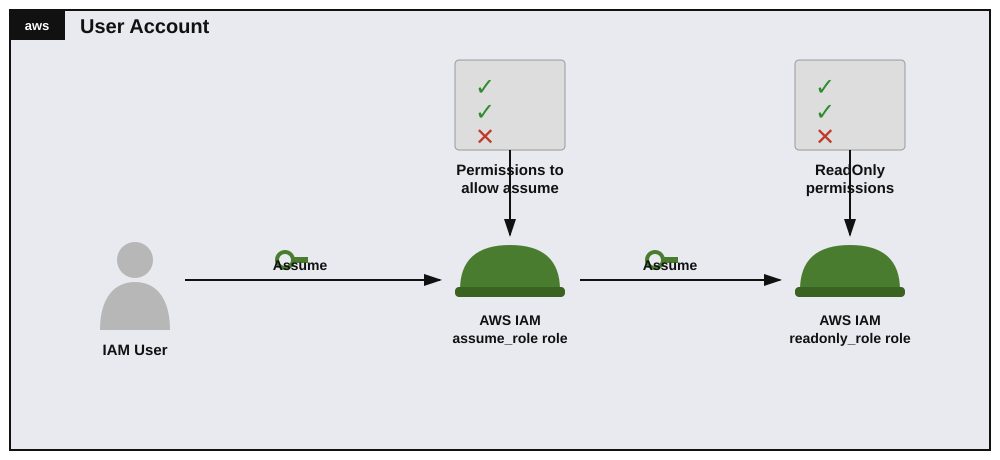

# Teoría — Role Chaining en AWS IAM

## Diagrama de la infraestructura del lab



Versión en texto (organigrama):

```
User Account
└── IAM User
    └── Assume ──► assume_role role   [Permissions to allow assume: sts:AssumeRole sobre readonly_role]
                        └── Assume ──► readonly_role role   [ReadOnly permissions]
```

Dos saltos de confianza en cadena: el usuario asume `assume_role`, y **con esas credenciales temporales** (no con las suyas propias) asume `readonly_role`. Ninguna de las dos políticas es "todo permitido" — cada una está acotada a un único propósito.

## Roles de IAM vs. usuarios

Un **rol de IAM** no tiene credenciales permanentes ni está ligado a una persona/aplicación específica — es una identidad que otras entidades ("trusted entities") pueden **asumir** temporalmente vía AWS STS (Security Token Service), obteniendo credenciales de corta duración (`AccessKeyId`, `SecretAccessKey`, `SessionToken`). Cada rol tiene dos políticas distintas y con propósitos diferentes:

| Tipo de política | Responde a | Se configura con |
|---|---|---|
| **Permission policy** (política de permisos) | "¿Qué puede hacer este rol una vez asumido?" | `attach-role-policy` (managed) / `put-role-policy` (inline) |
| **Trust policy** (política de confianza / `AssumeRolePolicyDocument`) | "¿Quién puede asumir este rol?" | `update-assume-role-policy` |

Es un error común confundirlas: la trust policy no otorga permisos sobre servicios de AWS, solo decide qué principal puede ejecutar `sts:AssumeRole` sobre ese rol.

## Role Chaining

"Role chaining" es cuando una identidad asume el Rol A, y **usando las credenciales temporales del Rol A** (no las credenciales originales del usuario) asume un Rol B. Cada eslabón de la cadena requiere:

1. El rol de origen debe tener permiso (`sts:AssumeRole`) sobre el ARN del rol destino en su **permission policy**.
2. El rol destino debe confiar explícitamente en el rol de origen como Principal en su **trust policy**.

Ambas condiciones deben cumplirse — si falta cualquiera de las dos, la llamada a `sts:AssumeRole` falla con `AccessDenied`.

> Limitación real de AWS STS: una sesión obtenida por role chaining tiene una duración máxima de **1 hora**, sin importar el `--duration-seconds` que se pida (a diferencia de asumir un rol directamente con credenciales de usuario/rol IAM normales, donde sí se puede pedir hasta 12 horas si el rol lo permite).

## Mínimo privilegio aplicado a este lab

- `assume_role` **no** tiene `AdministratorAccess` ni un `sts:AssumeRole` sobre `Resource: "*"` (cualquier rol) — solo puede asumir el ARN exacto de `readonly_role`. Esto se verifica intencionalmente con el AWS Policy Simulator probando primero con `*` (debe dar `denied`) y luego con el ARN específico (debe dar `allowed`).
- `readonly_role` usa la política administrada por AWS **`ReadOnlyAccess`**: acceso de lectura a prácticamente todos los servicios, pero **ninguna** acción de escritura/creación/eliminación.
- La trust policy de `readonly_role` limita el `Principal` exactamente al ARN de `assume_role` — ningún otro usuario o rol de la cuenta (ni de otra cuenta) puede asumirlo directamente.

## Herramienta de verificación: AWS IAM Policy Simulator

Permite simular si una acción específica (servicio + acción + recurso) sería permitida o denegada para un usuario/rol/grupo, **sin ejecutar realmente la acción** contra la cuenta real. Detalle importante: si no se especifica un recurso concreto, el simulador usa `*` (comodín) por defecto — si la política real está acotada a un ARN específico (como en este lab), simular contra `*` da `denied` aunque la configuración esté correcta; hay que cambiar el campo "Resource" al ARN exacto para obtener un resultado representativo.
