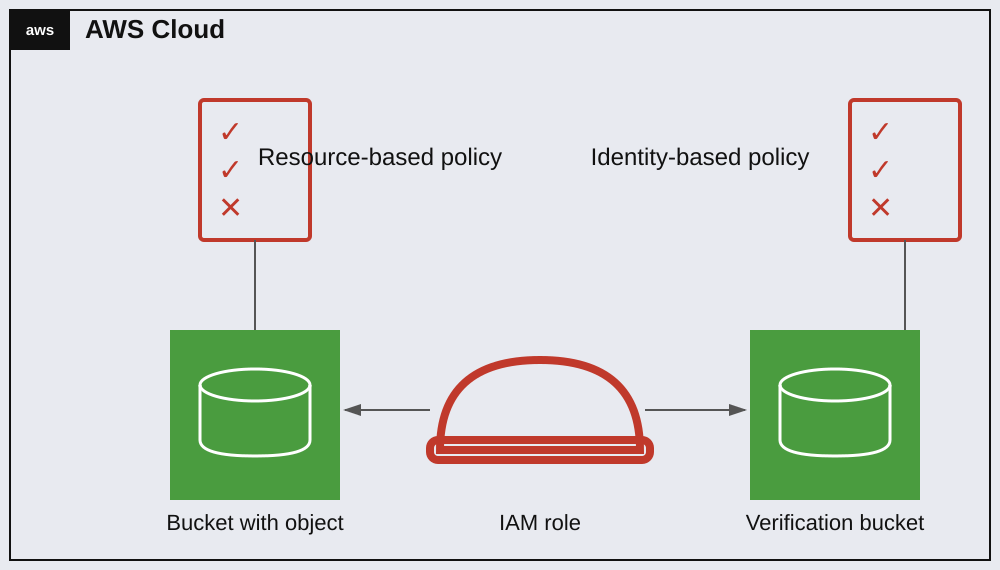

# Teoría — Policy Evaluation Logic (Deny)

## Diagrama de la infraestructura del lab



Versión en texto (organigrama):

```
AWS Cloud
├── Resource-based policy ──► Bucket with object (política adjunta al propio bucket)
└── Identity-based policy ──► IAM role ──► accede a: Bucket with object / Verification bucket
```

El rol tiene una **identity-based policy** (adjunta al rol: `AmazonS3FullAccess`) que le da acceso amplio a S3. El bucket tiene su propia **resource-based policy** (adjunta al bucket, independiente del rol) que puede sobreescribir ese acceso para principals específicos — en este lab, denegando el borrado de objetos justo para ese rol.

## Identity-based policies vs. Resource-based policies

| | Identity-based | Resource-based |
|---|---|---|
| **Se adjunta a** | Usuario, grupo o rol de IAM | El recurso mismo (bucket S3, KMS key, SQS queue, etc.) |
| **Define** | Qué puede hacer esa identidad | Quién puede acceder a ese recurso y qué puede hacer |
| **Requiere `Principal`** | No (implícito: la identidad a la que está adjunta) | Sí, siempre — hay que especificar explícitamente quién |
| **Ejemplo en este lab** | `AmazonS3FullAccess` adjunta al rol | La bucket policy con el statement `Deny` |

Ambos tipos de política se combinan en la evaluación de cada request — no son alternativas excluyentes, se suman.

## Lógica de evaluación de IAM: por qué gana el `Deny`

El algoritmo de evaluación de AWS IAM, resumido:

1. Por defecto: **denegado implícitamente**.
2. Se evalúan **todas** las políticas aplicables a la request — identity-based (usuario/rol) + resource-based (bucket, etc.) + SCPs + permission boundaries, sin importar el orden en que aparecen ni si son de un tipo u otro.
3. Si **cualquiera** de esas políticas contiene un `Deny` explícito que aplique a la acción/recurso, el resultado final es **Deny**, sin excepción.
4. Si no hay ningún `Deny` explícito, se requiere al menos un `Allow` explícito en alguna política aplicable.

Esto significa que un `Allow` en una política (por ejemplo, un `Allow s3:DeleteObject` que ya viniera en la bucket policy original de este lab) **nunca puede "ganarle"** a un `Deny` en otra política aplicable a la misma request, sin importar si el `Allow` es más específico, más nuevo, o de un tipo de política distinto (identity vs. resource). Es la base de por qué en este lab se puede coexistir con un statement `Allow` preexistente y aun así lograr el bloqueo total: basta con agregar el `Deny` correspondiente en cualquier política que aplique.

## Por qué el enunciado exige usar el policy simulator (o una prueba real) para verificar

Leer el JSON de la política y "ver a simple vista" que hay un Deny no es suficiente para confirmar el comportamiento real — hay que confirmar que el `Deny` efectivamente cubre la `Action` y el `Resource` exactos que se quieren bloquear, y que no hay algo (como un scope de `Resource` mal puesto) que deje un hueco. Por eso la verificación de este tipo de tareas siempre pide simular o ejecutar la acción real, no solo inspeccionar el documento de la política.
