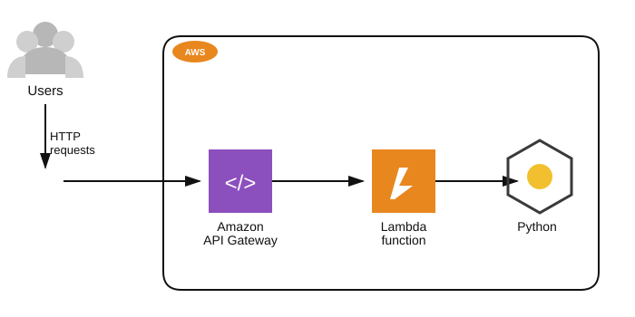

# Teoría — Lambda + API Gateway: dos direcciones de permisos

## Diagrama de la infraestructura del lab



Versión en texto:
```
Users --HTTP requests--> Amazon API Gateway --invoca--> Lambda function (Python)
```

## Las dos direcciones de permisos en una integración Lambda + API Gateway

Este lab ilustra un patrón muy común y que suele confundir al principio: hacen falta **dos configuraciones de permisos completamente distintas**, en direcciones opuestas:

| Dirección | Qué resuelve | Dónde se configura | Tipo de política |
|---|---|---|---|
| **Lambda → otros servicios de AWS** | Qué puede hacer el *código* de la función una vez que se ejecuta | Rol de ejecución de la función (`execution role`) | Identity-based policy |
| **API Gateway → Lambda** | Quién puede *invocar* la función desde afuera | La función Lambda misma | Resource-based policy |

Confundir estas dos direcciones es el error más común en este tipo de integraciones: dar permisos de invocación (2) no le da a la función ningún acceso a otros servicios, y dar permisos de ejecución (1) no habilita a nada externo a poder llamarla.

## Execution Role de Lambda

Cada función Lambda se ejecuta "como" un rol de IAM (el execution role). El código de la función, al hacer llamadas al SDK de AWS (`boto3` en Python, por ejemplo `lambda_client.list_functions()`), usa automáticamente las credenciales de ese rol vía las variables de entorno que Lambda inyecta en el entorno de ejecución. Si el código llama a una acción para la que el rol no tiene permiso, la llamada falla con `AccessDenied` — sin importar qué tan simple sea la función.

`AWSLambda_ReadOnlyAccess` es la política administrada por AWS para acciones de solo lectura sobre la propia API de Lambda (`ListFunctions`, `GetFunction`, etc.) — más acotada que `AWSLambda_FullAccess`, que además permite crear/actualizar/borrar funciones.

## Resource-based policy de Lambda (`lambda:AddPermission`)

A diferencia de S3 (donde se sube un documento JSON completo con `put-bucket-policy`), la política de recursos de una función Lambda se construye statement por statement con el comando `add-permission` — cada llamada agrega un nuevo `Statement` con un `--statement-id` único. El comando resultante configura, sobre la función:

```json
{
  "Effect": "Allow",
  "Principal": {"Service": "apigateway.amazonaws.com"},
  "Action": "lambda:InvokeFunction",
  "Resource": "arn:aws:lambda:...:function:mi-funcion",
  "Condition": {
    "ArnLike": {"AWS:SourceArn": "arn:aws:execute-api:...:API_ID/*/*"}
  }
}
```

El `--source-arn` es clave para el mínimo privilegio: sin él, *cualquier* API Gateway de la cuenta (o de cualquier cuenta) podría invocar la función. Acotarlo al ARN del API Gateway específico (con el patrón `execute-api:.../{api-id}/*/*`) garantiza que solo ese API Gateway en particular tenga el permiso.

## API Gateway HTTP API — Routes

A diferencia de las REST APIs clásicas de API Gateway, las **HTTP APIs** (API Gateway v2) son más livianas y rápidas de configurar, pero requieren que cada combinación método+path esté explícitamente definida como una **Route** (`RouteKey`, ej. `GET /get_list`). Pedir una URL que no coincide con ninguna route configurada devuelve `{"message":"Not Found"}` — no significa que la Lambda o los permisos estén mal, solo que el path/método de la request no tiene una ruta asociada. Se puede consultar la lista de rutas configuradas con `aws apigatewayv2 get-routes --api-id <id>`.
