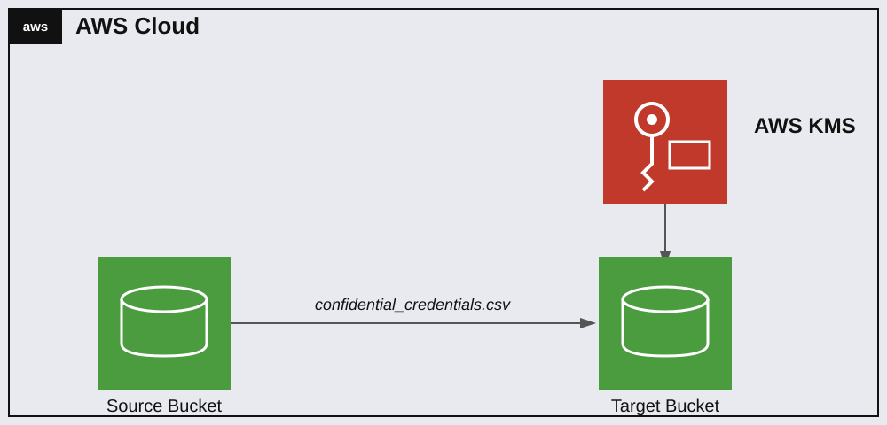

# Teoría — Protegiendo datos en S3 con una KMS Customer Managed Key

## Diagrama de la infraestructura del lab



## AWS KMS — Customer Managed Keys

Una **customer managed key (CMK)** es una clave de cifrado que el usuario crea y controla dentro de su cuenta (a diferencia de las AWS managed keys, que AWS crea y gestiona automáticamente para cada servicio, ej. `aws/s3`). Ventajas de usar una CMK propia:
- Se puede definir exactamente quién puede usarla (key policy) y para qué acciones.
- Se puede rotar, deshabilitar o programar su eliminación de forma independiente.
- Se puede auditar su uso específicamente vía CloudTrail (cada `Encrypt`/`Decrypt` queda registrado con el ARN exacto de la key).

## Key Policy — el "resource-based policy" de una KMS key

Cada KMS key tiene su propia política de recursos (`key policy`), separada de cualquier política de IAM. Por defecto, AWS crea las keys con un statement estándar:

```json
{
  "Sid": "Enable IAM User Permissions",
  "Effect": "Allow",
  "Principal": {"AWS": "arn:aws:iam::<account-id>:root"},
  "Action": "kms:*",
  "Resource": "*"
}
```

Este statement es clave: al dar `kms:*` al **root de la cuenta** (no a un usuario/rol específico), delega el control de acceso real a las políticas de IAM de la cuenta — cualquier usuario/rol con una política de IAM que permita acciones sobre esa key ARN puede usarla, **sin necesidad de tocar la key policy en absoluto**. Es la razón por la que en este lab solo hizo falta darle permisos al rol vía una política de IAM (identity-based) — la key policy por defecto ya delegaba el control ahí. Si esa key hubiera sido creada con una key policy más restrictiva (sin ese statement, o limitando el `Principal` a roles específicos), habría sido necesario editar también la key policy para agregar el rol como principal permitido — igual que se hizo con la bucket policy en el lab 2.6/2.7.

## Server-Side Encryption con KMS (SSE-KMS) en S3

`put-bucket-encryption` configura el cifrado **por defecto** de un bucket: cualquier objeto subido sin especificar explícitamente otro método de cifrado queda cifrado automáticamente con la key indicada. Parámetros relevantes:

- `SSEAlgorithm: aws:kms` — usa KMS (en vez de `AES256`, que sería SSE-S3 con clave gestionada por AWS, no una CMK propia).
- `KMSMasterKeyID` — el ARN de la CMK específica a usar.
- `BucketKeyEnabled: true` — habilita "S3 Bucket Keys", una optimización que reduce las llamadas a KMS (y su costo) reutilizando una clave de bucket derivada por un tiempo limitado, en vez de llamar a KMS por cada objeto.

## Restringir el uso de OTRAS keys (bucket policy con Deny)

Además de configurar el cifrado por defecto, es común (y es lo que ya traía preconfigurado este lab) agregar una **bucket policy con Deny** que rechace explícitamente cualquier subida que especifique una key de KMS distinta a la autorizada — típicamente con una condición como:

```json
"Condition": {
  "StringNotLikeIfExists": {
    "s3:x-amz-server-side-encryption-aws-kms-key-id": "arn:aws:kms:...:key/<key-id-permitida>"
  }
}
```

Esto es necesario porque `put-bucket-encryption` (cifrado por defecto) solo aplica cuando el cliente **no especifica** una key explícitamente al subir — si alguien sube un objeto indicando manualmente otra KMS key, el cifrado por defecto del bucket no lo detiene por sí solo. El Deny en la bucket policy es la capa que sí lo bloquea, sin importar qué key pida el cliente en la request.
