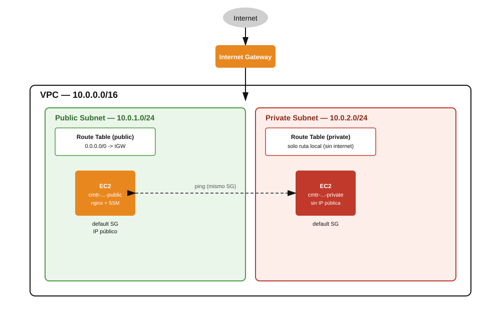

# Teoría — VPC propia con subredes pública y privada

## Diagrama de la infraestructura del lab

## Componentes de una VPC

| Componente | Rol |
|---|---|
| **VPC** | Red virtual aislada dentro de la cuenta de AWS, definida por un bloque CIDR (rango de IPs privadas) |
| **Subnet** | Subdivisión de la VPC, atada a una única Availability Zone, con su propio rango CIDR (subconjunto del de la VPC) |
| **Internet Gateway (IGW)** | Componente que se adjunta a la VPC para permitir tráfico bidireccional con internet |
| **Route Table** | Conjunto de reglas de enrutamiento; se asocia a una o más subredes y decide a dónde va el tráfico saliente |
| **Security Group** | Firewall a nivel de instancia (stateful) — controla qué tráfico entra/sale de cada instancia |

## Qué hace que una subred sea "pública" o "privada"

Contrario a la intuición, **no existe un flag "esta subred es pública"** en AWS — la distinción es puramente una consecuencia de **a qué route table está asociada**:

- **Subred pública**: su route table tiene una ruta `0.0.0.0/0 -> Internet Gateway`.
- **Subred privada**: su route table **no** tiene ninguna ruta hacia un IGW (solo la ruta `local` que AWS agrega automáticamente para el tráfico dentro de la propia VPC).

Toda route table nueva viene con una ruta `local` implícita para el CIDR de la VPC — por eso la subred privada de este lab sigue pudiendo comunicarse con la subred pública (ambas están en el mismo VPC, cubiertas por esa ruta local), pero no tiene salida a internet.

## Por qué la instancia pública necesita IP pública, no solo estar en la subred "pública"

Estar en una subred con ruta al IGW es condición *necesaria* pero no *suficiente* para tener conectividad a internet — la instancia además necesita una **dirección IP pública** asignada (ya sea automáticamente vía "auto-assign public IP" de la subred, o explícitamente al lanzarla con `--associate-public-ip-address`). Sin IP pública, el tráfico de retorno desde internet no tendría a dónde volver, aunque la ruta de salida exista.

## El Security Group "default" y por qué el ping entre instancias funciona

El *default security group* de una VPC tiene, de fábrica, una regla de entrada que permite **todo el tráfico proveniente de recursos que tengan ese mismo security group asignado** (además de permitir todo el tráfico de salida). Por eso, con solo asignar el `default` SG a ambas instancias (pública y privada), el `ping` entre ellas funciona sin tener que abrir manualmente el protocolo ICMP — la regla ya cubre cualquier tráfico entre miembros del mismo grupo, sin importar el tipo.

## Instance Profile para AWS Systems Manager (Session Manager)

Para conectarse a una instancia EC2 sin SSH ni pares de llaves, Session Manager requiere que la instancia tenga adjunto un **Instance Profile** que contenga un rol de IAM con la política administrada `AmazonSSMManagedInstanceCore`. Ese rol debe tener como entidad de confianza (trust policy) al servicio `ec2.amazonaws.com`. El flujo de creación es en 4 pasos separados (a diferencia de crear una sola política): `create-role` (rol + trust policy) → `attach-role-policy` (permisos) → `create-instance-profile` (el contenedor que EC2 realmente referencia) → `add-role-to-instance-profile` (vincular el rol al contenedor). Hay que tener en cuenta la **consistencia eventual de IAM**: recién creado, un instance profile puede tardar unos segundos en propagarse antes de que `run-instances` lo reconozca — de ahí la pausa antes de lanzar la instancia.

## EC2 User Data

El campo `--user-data` de `run-instances` permite pasar un script (interpretado por `cloud-init` en el primer arranque) para automatizar configuración sin tener que conectarse manualmente — en este lab, instalar y arrancar `nginx` justo cuando la instancia arranca por primera vez, sin intervención humana.
