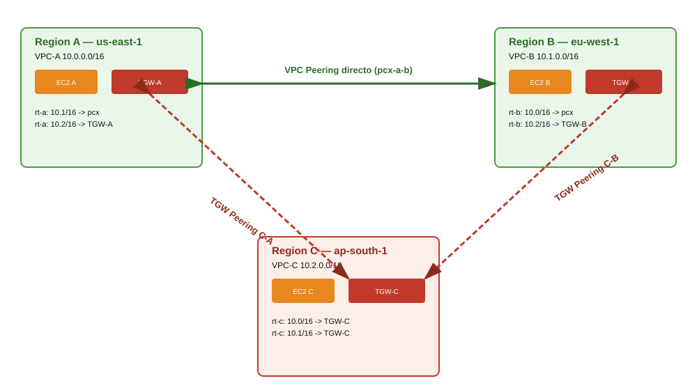

# Teoría — VPC Peering entre regiones + Transit Gateway

## Diagrama de la infraestructura del lab

## VPC Peering — conexión punto a punto, no transitiva

Una conexión de **VPC Peering** conecta exactamente **dos** VPCs (que pueden estar en distintas cuentas y/o regiones) a nivel de red, como si estuvieran en la misma red — sin pasar por internet. Su limitación clave: **no es transitiva**. Si A está peered con B, y B estuviera peered con C, A **no** podría alcanzar a C a través de B — cada par de VPCs que necesite comunicarse requeriría su propia conexión de peering dedicada. Con `N` VPCs que necesitan comunicarse todas entre sí, se necesitarían `N*(N-1)/2` conexiones de peering — no escala.

Cada conexión de peering tiene un lado **requester** (quien la inicia) y un lado **accepter** (quien debe aceptarla explícitamente para que quede activa) — pueden estar en regiones distintas (`--peer-region`), y cada lado necesita agregar una ruta en su propia route table apuntando al `VpcPeeringConnectionId` para el CIDR de la otra VPC.

## AWS Transit Gateway — un hub central

Un **Transit Gateway (TGW)** actúa como un router/hub centralizado al que se conectan múltiples VPCs (vía "VPC attachments"). A diferencia del peering, el TGW sí resuelve el problema de escala: cada VPC solo necesita un attachment al TGW de su región, y el TGW enruta el tráfico entre todos sus attachments según su propia route table.

## Por qué este lab combina ambos mecanismos

- A y B se conectan con **VPC Peering directo** — sencillo, dos VPCs, sin necesidad de infraestructura adicional.
- C se conecta a A y B mediante **Transit Gateway Peering** — un TGW por región, con una conexión de peering *entre Transit Gateways* (no entre VPCs) desde el TGW de C hacia el TGW de A, y otra hacia el TGW de B.

Esto demuestra un patrón de arquitectura real: cuando el número de VPCs/regiones que necesitan interconectarse crece, se migra de peering punto a punto hacia un modelo hub-and-spoke con Transit Gateway, sin tener que rehacer las conexiones ya existentes (A-B siguió funcionando igual con peering directo).

## TGW Peering Attachment — conceptualmente similar al VPC Peering, pero entre TGWs

Igual que el VPC Peering, un TGW Peering Attachment tiene un lado requester y un lado accepter (que puede estar en otra región, y requiere `--peer-account-id` explícito incluso dentro de la misma cuenta, según la versión del CLI). Una vez aceptado, el mismo `TransitGatewayAttachmentId` es visible y usable desde **ambos** lados/regiones.

## Rutas estáticas vs. propagación automática en TGW Route Tables

Cuando se adjunta una VPC a un TGW (VPC attachment), por defecto **se propaga automáticamente** el CIDR de esa VPC a la route table del TGW — no hace falta agregar esa ruta a mano. Sin embargo, para un **TGW Peering Attachment**, la propagación automática **no aplica** — hay que agregar manualmente una ruta estática (`create-transit-gateway-route`) en la route table de cada TGW, apuntando al `TransitGatewayAttachmentId` de la conexión de peering, para el CIDR de la VPC del otro lado. Esto es justamente lo que pedía el enunciado en "Update the transit gateway route tables by adding static routes".

## Dos niveles de rutas necesarios para que el tráfico fluya

Para que el tráfico de una instancia en A llegue a una instancia en C vía TGW, hacen falta rutas en **dos niveles** distintos:
1. **Route table de la VPC** (`rt-a`): debe saber que el tráfico hacia `10.2.0.0/16` (CIDR de C) sale por el Transit Gateway local (`--transit-gateway-id`, no el ID del attachment).
2. **Route table del Transit Gateway** (`tgw-rtb-...`): debe saber que el tráfico hacia `10.2.0.0/16` sale por el peering attachment específico hacia el TGW de C.

Faltar cualquiera de las dos rutas rompe la conectividad, aunque los recursos (VPC attachment, peering attachment) estén todos en estado `available`.
