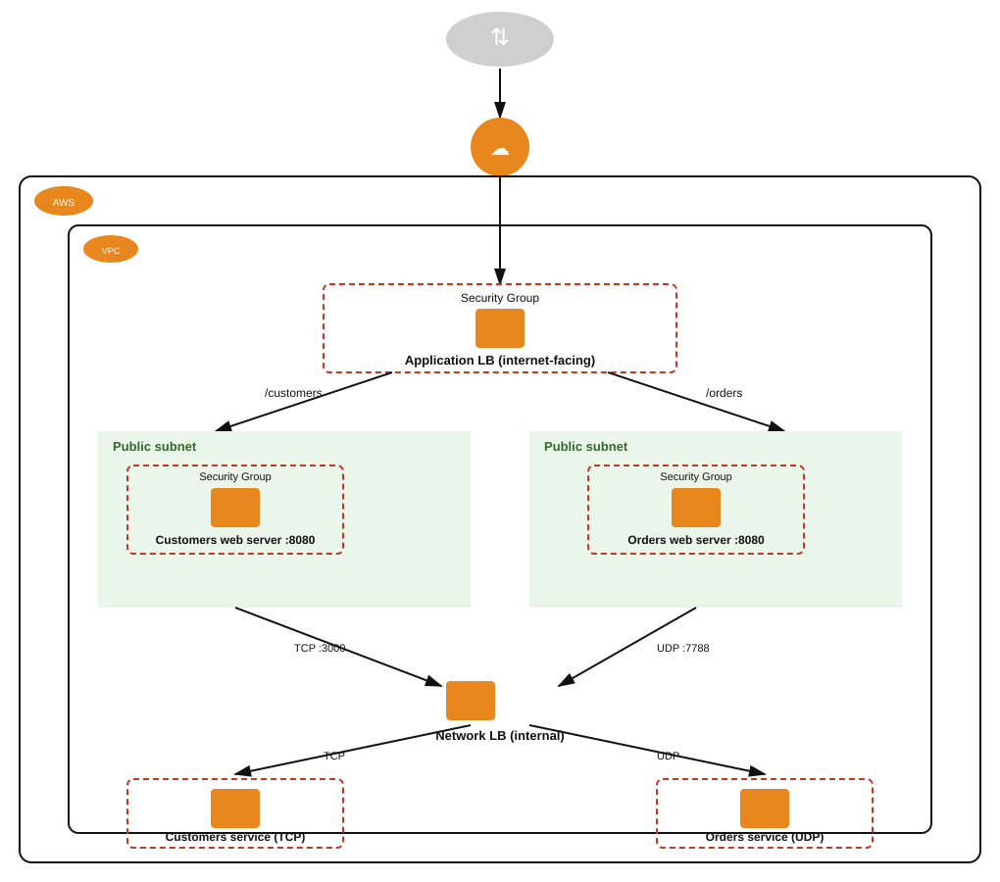

# Teoría — Arquitectura multi-capa con ALB + NLB

## Diagrama de la infraestructura del lab

## Application Load Balancer (ALB) vs. Network Load Balancer (NLB)

| | ALB | NLB |
|---|---|---|
| Capa OSI | 7 (aplicación — HTTP/HTTPS) | 4 (transporte — TCP/UDP/TLS) |
| Enrutamiento | Por contenido: path, host, headers, query string | Por IP/puerto, sin inspeccionar el contenido |
| Uso típico | Microservicios HTTP, path-based routing | Alto rendimiento/baja latencia, protocolos no-HTTP, IP estática |
| Soporta UDP | No | Sí |

Este lab usa un ALB **internet-facing** como punto de entrada público (solo entiende HTTP), y un NLB **interno** para el tráfico TCP/UDP entre los web servers y los backend services — el NLB no podría hacer routing por path (`/customers` vs `/orders`) porque opera a nivel de conexión, no de contenido HTTP; por eso el path-based routing ocurre únicamente en el ALB, capa arriba.

## Listeners, Target Groups y Reglas

- **Listener**: define en qué puerto/protocolo escucha el load balancer (ej. HTTP:80 en el ALB, TCP:3000 y UDP:7788 en el NLB).
- **Target Group**: conjunto de destinos (instancias EC2, IPs, o funciones Lambda) hacia donde se enruta el tráfico, cada uno con su propio health check.
- **Reglas de listener** (solo en ALB): condiciones (`path-pattern`, `host-header`, etc.) que determinan a qué Target Group se envía cada request, evaluadas en orden de prioridad. La **acción por defecto** del listener aplica cuando ninguna regla hace match.

## El patrón de este lab: 2 reglas + default action de redirect

- Regla de prioridad más alta: `path-pattern: /customers*` → forward a `tg-cust`.
- Otra regla: `path-pattern: /orders*` → forward a `tg-orders`.
- **Default action** del listener (lo que aplica si ninguna regla coincide, ej. la ruta `/`): en vez de un `forward` fijo, un **redirect HTTP 302** hacia `/orders` — de modo que cualquier path no reconocido termina, tras el redirect, sirviendo el contenido de Orders. Esto explica por qué la verificación de `/` devuelve el mismo contenido que `/orders`: no es la misma regla, es una redirección HTTP real (el navegador/cliente recibe un 302 y vuelve a pedir `/orders`).

## Puerto de health check distinto al puerto de tráfico

El enunciado aclara que cada instancia tiene el puerto `5001` abierto específicamente para los health checks del load balancer — separado de los puertos de tráfico real (`8080`, `3000`, `7788`). Esto es una configuración de **Target Group** (`HealthCheckPort` puede fijarse a un valor distinto del puerto de tráfico registrado), útil cuando el health check de la aplicación vive en un endpoint/puerto administrativo separado del que sirve el tráfico de negocio.
