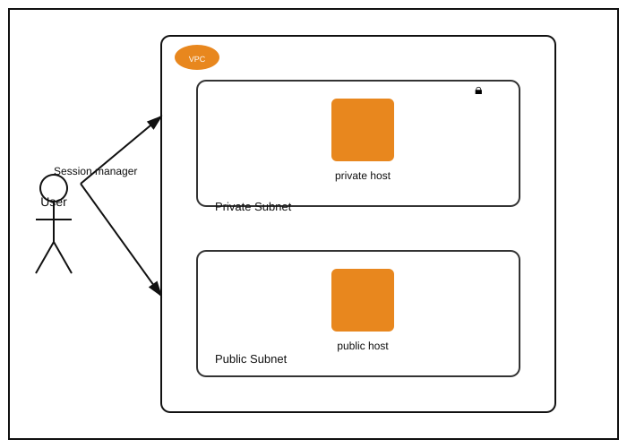

# Teoría — Session Manager sin acceso a internet ni bastion host

## Diagrama de la infraestructura del lab

## El problema que resuelve Session Manager

Tradicionalmente, para administrar una instancia en una **subred privada** (sin IP pública ni ruta a internet) se necesitaba un **bastion host**: una instancia en la subred pública que sí es alcanzable desde fuera, a través de la cual se hace "salto" (SSH jump) hacia las instancias privadas. Esto implica mantener, parchear y asegurar una instancia adicional cuyo único propósito es ser puerta de entrada — superficie de ataque extra y costo adicional.

**AWS Systems Manager Session Manager** elimina esa necesidad: el **SSM Agent**, instalado en la instancia, inicia una conexión **saliente** hacia el servicio de Systems Manager (no requiere ningún puerto de entrada abierto, ni siquiera el 22 de SSH). El usuario se conecta a través de la API de AWS (`aws ssm start-session`), que internamente hace de intermediario — sin necesidad de bastion host, sin exponer ningún puerto de administración a internet.

## El requisito que sigue existiendo: el SSM Agent necesita alcanzar el servicio de Systems Manager

Aunque Session Manager no requiere puertos de entrada, el **SSM Agent sí necesita poder alcanzar salientemente** los endpoints del servicio SSM (`ssm`, `ssmmessages`, `ec2messages`). Para una instancia en una subred privada **sin NAT Gateway ni ruta a internet**, esto solo es posible mediante:
- **VPC Endpoints de tipo Interface** para `com.amazonaws.<region>.ssm`, `ssmmessages` y `ec2messages` — exponen esos servicios dentro de la propia VPC vía IPs privadas (ENIs), sin salir a internet.
- O bien, una ruta hacia internet (NAT Gateway) — lo cual anula el propósito de mantener la instancia "sin acceso a internet".

Este lab asume que la infraestructura de red (VPC Endpoints) ya existe — el foco de los "2 movimientos" está en el lado de **IAM**, no de networking.

## El rol de IAM: pieza que casi siempre falta

Para que el SSM Agent de una instancia pueda autenticarse ante el servicio de Systems Manager, la instancia necesita un **Instance Profile** con un rol que tenga la política administrada `AmazonSSMManagedInstanceCore` — exactamente el mismo patrón visto en el lab 3.1 (VPC). La causa más común de "no puedo conectarme por Session Manager" no es de red, sino que **falta este rol** (o falta adjuntarlo a la instancia específica) — el propio enunciado lo insinúa al mencionar el `IAM Role cmtr-iacp1ebx-ec2-sms-iam_role` como uno de los recursos centrales de la tarea.

## Propagación de permisos de IAM y reinicio de instancia

El enunciado advierte que los cambios de permisos de IAM pueden tardar hasta 5 minutos en propagarse al SSM Agent de una instancia ya corriendo, y sugiere que **reiniciar la instancia** puede acelerar que el agente reconozca el nuevo rol/permisos — el agente SSM normalmente refresca sus credenciales periódicamente, pero un reinicio fuerza una relectura inmediata del Instance Profile asociado.
