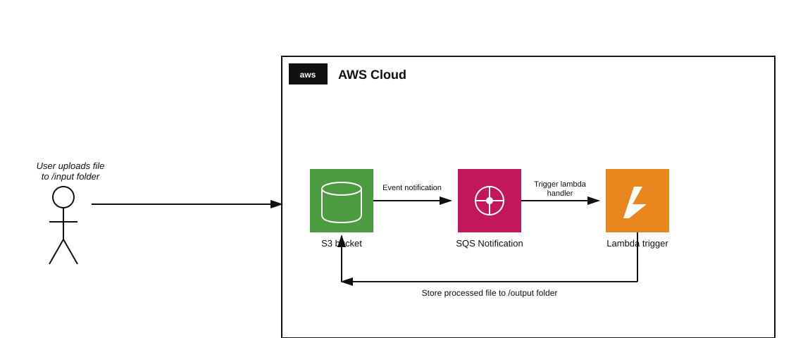

# Teoría — Arquitectura orientada a eventos: S3 → SQS → Lambda

## Diagrama de la infraestructura del lab

## Por qué desacoplar S3 y Lambda con una cola SQS en el medio

S3 puede invocar una función Lambda **directamente** al crearse un objeto (notificación S3 → Lambda), sin necesidad de una cola intermedia. Meter SQS en el medio (S3 → SQS → Lambda) agrega:

- **Buffer/desacoplamiento**: si la Lambda está ocupada, con error, o hay un pico de subidas, los mensajes esperan en la cola en vez de perderse o forzar reintentos agresivos contra S3.
- **Control de concurrencia y throughput**: el *event source mapping* de Lambda sobre SQS controla cuántos mensajes se procesan por lote (`--batch-size`) y cuántas invocaciones concurrentes se disparan, evitando saturar recursos downstream.
- **Reintentos y Dead-Letter Queues**: SQS puede reintentar automáticamente mensajes que fallaron, y enviarlos a una DLQ tras N intentos — un patrón de resiliencia más robusto que el manejo de errores nativo de las notificaciones directas S3→Lambda.

## Dos configuraciones separadas para dos relaciones distintas

Igual que en el lab 2.8 (Lambda + API Gateway), aquí hay **dos configuraciones independientes**, cada una en su propio recurso:

1. **Notificación del bucket S3 hacia SQS** (`put-bucket-notification-configuration`): configurada **en el bucket**, define qué eventos (`s3:ObjectCreated:*`), con qué filtro de prefijo (`input/`), se publican como mensaje hacia la cola.
2. **Event Source Mapping de Lambda sobre SQS** (`create-event-source-mapping`): configurado **en Lambda**, define que la función debe hacer *polling* de la cola y ejecutarse por cada lote de mensajes que lleguen.

Ninguna de las dos por sí sola completa el flujo — hace falta la notificación (para que lleguen mensajes a la cola) y el trigger (para que Lambda los consuma).

## Filtro de prefijo en notificaciones de S3

El bloque `Filter.Key.FilterRules` con `Name: "prefix", Value: "input/"` asegura que **solo** los objetos subidos dentro de `input/` disparen una notificación — evita, por ejemplo, un bucle infinito si la propia Lambda escribe sus resultados en el mismo bucket (en `output/`) y esos objetos también generaran eventos `ObjectCreated`.

## Event Source Mapping: polling, no push

A diferencia de una notificación de S3 (que "empuja" el evento), el mecanismo de Lambda sobre SQS funciona por **polling**: el servicio de Lambda internamente consulta la cola de forma continua y por su cuenta, invocando la función cuando encuentra mensajes — el `State: Enabled` del mapping es lo que activa este comportamiento. Este estado tarda unos segundos en pasar de `Creating` a `Enabled` tras crearlo, de ahí la advertencia del enunciado de "esperar a que el trigger se cree" antes de subir el archivo de prueba.
